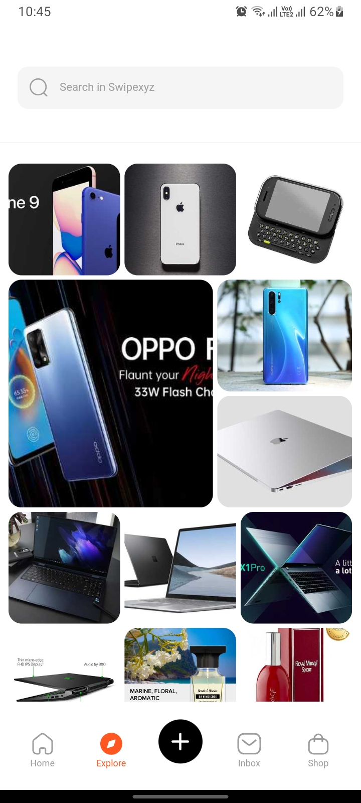
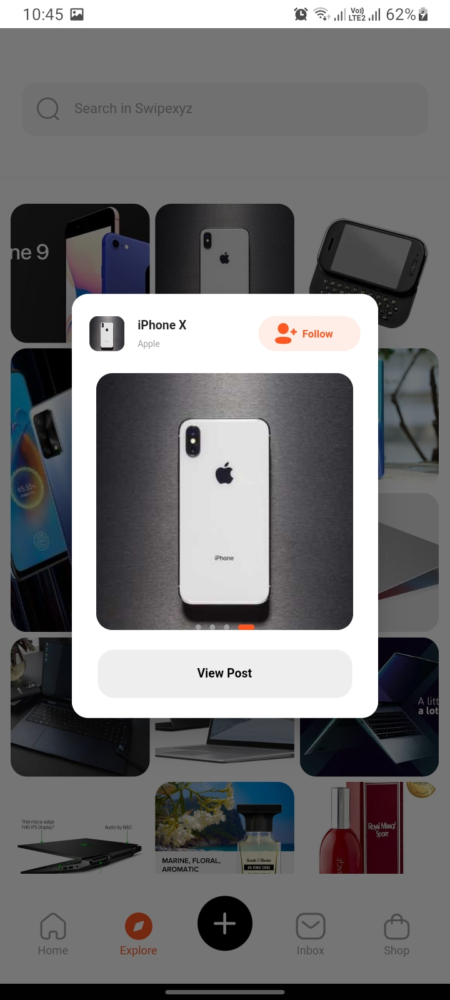

# Softcent Test Task

This project is a test assignment provided by Softcent.

### Key Features:
1. Implementation of Stunning UI.
2. Implementation of Getx State Management Library.
3. Structured and Clean Code.
These are the major features included in this project. 

### Getx for State Management

### Output Screens:
Home Screen        |  Home Screen(cont.)    |
:-------------------------:|:-------------------------:|
  |    |

 

Dialog Screen        |  Dialog Screen(cont.)     |
:-------------------------:|:-------------------------:|
  |    |

 

Link of the APK File(Release Mode): https://drive.google.com/file/d/1wuIsXQYwgPubAmSaEgUal0hUB1xKAZz-/view?usp=sharing
